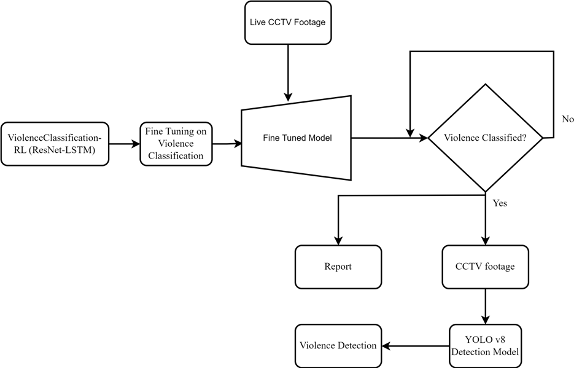

# Emergency-response
Project for Fuse Machine AI Fellowhsip 2024

## Introduction
This project focuses on detecting and classifying violent activities in real-time video frames. It leverages deep learning models, including ResNet18 combined with LSTM for classification and YOLOv8 for object detection, to analyze and identify potential violent events in video streams.
## Goals
- Accurately classify frames from real-time video streams into violent or non-violent categories.
- Detect specific violent actions and objects in the scene using YOLOv8.
- Optimize system performance to achieve real-time processing speeds.

## Demo

## Contributors
- Yugratna Humagain
- [@Aarogya Bhandari](https://github.com/amewzzz)
- [@Girban Adhikari](https://github.com/adgirban)
- [@Jivan Acharya](https://github.com/JivanAcharya)
- [@Yugratna Humagain](https://github.com/yugratna19)
## Project Architecture

# Status
## Known Issue
## High Level Next Steps
- Fine-tune ResNet18+LSTM model for better accuracy.
- Integrate YOLOv8 with classification output.
- Optimize real-time performance (e.g., reducing latency).

# Usage
## Installation
To begin this project, use the included `Makefile`

#### Creating Virtual Environment

This package is built using `python-3.8`. 
We recommend creating a virtual environment and using a matching version to ensure compatibility.

#### pre-commit

`pre-commit` will automatically format and lint your code. You can install using this by using
`make use-pre-commit`. It will take effect on your next `git commit`

#### pip-tools

The method of managing dependencies in this package is using `pip-tools`. To begin, run `make use-pip-tools` to install. 

Then when adding a new package requirement, update the `requirements.in` file with 
the package name. You can include a specific version if desired but it is not necessary. 

To install and use the new dependency you can run `make deps-install` or equivalently `make`

If you have other packages installed in the environment that are no longer needed, you can you `make deps-sync` to ensure that your current development environment matches the `requirements` files. 

## Usage Instructions

# Data Source
## Code Structure
The project consists of the following files and directories:

- 📂 REALTIME
- ├── 📂 __pycache__          # Python cache files (auto-generated)
- ├── 📂 flagged              # Directory where flagged video frames or data are stored
- ├── 📂 venv                 # Virtual environment for Python dependencies
- ├── 📄 app.py               # Main application entry point for running the real-time system
- ├── 📄 detection.py         # Contains functions or logic for detection using YOLOv8
- ├── 📄 realtime_detection.py # Core script for handling real-time violence detection using ResNet18+LSTM and YOLOv8
- ├── 📄 save_10sec.py        # Script to save 10-second video clips from the stream
- ├── 📄 test.py              # Script for testing model outputs and performance
- └── 📄 best_violence_detection_model.pth # Trained ResNet18+LSTM model (PyTorch format)
File Descriptions:
- app.py: This file likely serves as the main entry point for the real-time violence detection system, handling input streams and orchestrating the pipeline.

- detection.py: Contains YOLOv8-based detection logic. It is likely using the RoboFlow API for retrieving the pre-trained detection model (detection_model = get_model(...)).

- realtime_detection.py: Core script that integrates the classification and detection models. It probably handles frame classification with ResNet18+LSTM and object detection using YOLOv8.

- save_10sec.py: A utility script to save 10-second video clips, perhaps for flagged incidents or evaluation purposes.

- test.py: Script to test or validate models during development. This might include running inference on sample data to ensure the models work as expected.

- flagged/: Directory to store flagged video frames, possibly for post-analysis or manual review.

- venv/: A local virtual environment for the project’s dependencies.

- best_violence_detection_model.pth: The saved PyTorch model for the ResNet18+LSTM, trained on Kaggle for violence classification.
## Artifacts Location
- YOLOv8 Detection Model:

- Source: The YOLOv8 model is pulled from Roboflow using the following code:
- detection_model = get_model(model_id="emergency-response/1", api_key=detection_api_key)
- Location: This model is retrieved on-the-fly from Roboflow's API, so it isn't stored locally unless explicitly saved.
- ResNet18 + LSTM Model:

- Location: The model file is located in the project directory as best_violence_detection_model.pth.
- Source: This model was trained on Kaggle and exported for use in real-time classification tasks.
# Results
## Metrics Used
The following metrics were used to evaluate the models:

- **Accuracy**: Measures the proportion of correctly classified instances.
- **F1 Score**: Harmonic mean of Precision and Recall, providing a balance between the two.
- **Precision**: The ratio of true positive predictions to the total predicted positives.
- **Recall**: The ratio of true positive predictions to the actual positives.
- **mAP (mean Average Precision)**: Used for object detection, calculates the average precision across different classes.

## Evaluation Results

| Classification Model (ResNet18 + LSTM) | Accuracy (%) | F1 Score (%) | Precision (%) | Recall (%) |
|----------------------------------------|--------------|--------------|---------------|------------|
|                                        | 96.50%       | 96.52%       | 95.57%        | 96.52%     |

| Detection Model (YOLOv8)               | mAP (%)      | Precision (%)| Recall (%)    |            |
|----------------------------------------|--------------|--------------|---------------|------------|
|                                        | 70.70%       | 76.60%       | 64.10%        |            |
